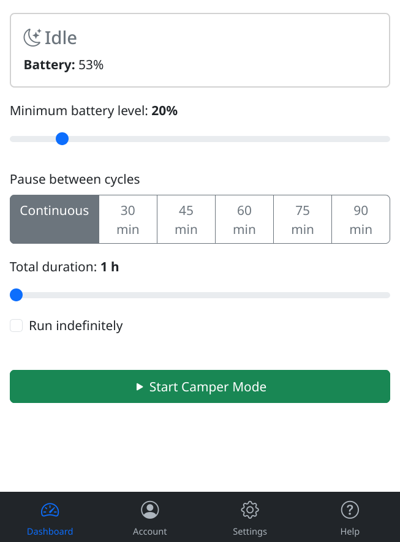

# carconnectivity-plugin-campermode

A [CarConnectivity](https://github.com/tillsteinbach/CarConnectivity) plugin providing a mobile-friendly web UI for overnight car
climatisation cycling - periodic heating/cooling with battery safety and timer
scheduling (camper mode).

## Features

- Periodic climatisation cycles (configurable duration and pause between cycles)
- Battery safety: auto-stop below configurable threshold
- Timer scheduling for automatic activation
- Mobile-first web UI at a dedicated port
- VW seat/zone heating disabled during cycles to minimise battery consumption
  (window heating, front/rear seat zones, steering wheel, mirror, rear window, windscreen)

## Prerequisites

- [CarConnectivity](https://github.com/tillsteinbach/CarConnectivity) installed and configured with a connector (only tested with VW so far)
- Python 3.10 or later

## Installation

```bash
pip install carconnectivity-plugin-campermode
```



## Accessing the web UI

Once CarConnectivity is running, open your browser at:

```
http://<host>:<port>
```

where `host` and `port` match the values in your configuration (default:
`http://localhost:4001`). If authentication is configured, you will be prompted
to log in.

## Configuration

Add to your `carconnectivity.json` (comments shown for documentation — remove
them from the actual file as JSON does not support comments).

> **Note:** `carconnectivity.json` contains credentials and should be readable
> only by the user running the service:
> ```bash
> chmod 600 carconnectivity.json
> ```

```jsonc
{
    "type": "campermode",
    "config": {
        // ── Web UI ───────────────────────────────────────────────────────────
        // Network interface the web server listens on.
        // "0.0.0.0" = all interfaces; "127.0.0.1" = localhost only.
        "host": "0.0.0.0",

        // TCP port for the web UI. Default: 4001.
        "port": 4001,

        // ── Authentication ───────────────────────────────────────────────────
        // Single-user login. Both keys must be present to enable auth.
        // When omitted the UI is accessible without a password.
        "username": "admin",
        "password": "secret",

        // Multi-user alternative to username/password above.
        // "users": [
        //     { "username": "alice", "password": "hunter2" },
        //     { "username": "bob",   "password": "s3cr3t"  }
        // ],

        // ── HTTPS ────────────────────────────────────────────────────────────
        // Set to true to enable TLS. Without certificate paths below, a
        // temporary self-signed certificate is generated automatically.
        // "https": true,

        // Provide your own certificate/key pair instead of the auto-generated one.
        // "ssl_certificate_file":     "/etc/ssl/certs/campermode.crt",
        // "ssl_certificate_key_file": "/etc/ssl/private/campermode.key",

        // ── Session security ─────────────────────────────────────────────────
        // Flask session secret key. Set this to a long random string in
        // production; if omitted a new key is generated on every restart,
        // which invalidates all active browser sessions.
        // Generate with: openssl rand -hex 32
        // "secret_key": "change-me-to-a-long-random-string",

        // ── Vehicle targeting ────────────────────────────────────────────────
        // VIN of the vehicle to control. When omitted the first vehicle
        // found in the garage is used automatically.
        // "vin": "WVWZZZ1JZXXXXXXXX",

        // ── Persistence ──────────────────────────────────────────────────────
        // Path to the JSON file where climatisation settings and timers are
        // stored. Default: "campermode.json" (relative to the working directory).
        // "data_file": "/var/lib/carconnectivity/campermode.json"
    }
}
```

